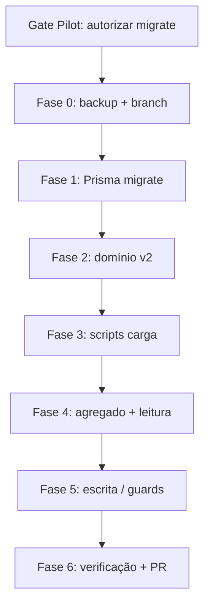

# Plano de trabalho — implementação schema v2 (Fase 1 constitucional)

| Campo | Valor |
|-------|--------|
| **Audiência** | Implementador (AI Dev Machine ou engenharia) |
| **Pilot** | Aprova gates, autoriza `prisma migrate` e merge para produção |
| **Data** | 2026-05-18 |
| **Estado** | Pronto para execução após **autorização explícita** do Pilot (migrate) |

---

## Objetivo (uma frase)

Aplicar o schema v2 aprovado (ADR 0014/0015), carregar o **par constitucional piloto** no Hub sem regressão dos instrumentos v1, e expor leitura v2 via camada de serviço (agregado derivado + resolução de `idrRef`).

---

## Gate de entrada (obrigatório antes de Step 1.1)

O implementador **não inicia** migração de base nem alteração de `schema.prisma` até o Pilot confirmar por escrito (issue, PR ou mensagem):

- [ ] ADR 0014 e 0015 — **Accepted** (feito)
- [ ] Mapa Fase 1 — **fechado PO** (feito)
- [ ] Spec Prisma — **revisada e aprovada** pelo PO/Pilot
- [ ] **Autorização explícita** para `prisma migrate` e deploy em ambiente alvo (lab/staging)

Sem este gate: limitar-se a revisão de código e dry-runs locais contra cópia da BD.

---

## Artefactos autoritativos (ler na ordem)

| # | Documento |
|---|-----------|
| 1 | `docs/methodology/pilot-machine-methodology.md` |
| 2 | `Docs/adr/0014-dochub-phase1-constitutional-structural-model.md` |
| 3 | `Docs/adr/0015-dochub-schema-v2-normative-tree.md` |
| 4 | `hub-preop/docs/migration-map-phase1-constitutional-pair.md` |
| 5 | `hub-preop/docs/spec-prisma-migration-v2-phase1.md` |
| 6 | `hub-preop/prisma/schema.v2-proposed.prisma` |
| 7 | `System registry.MD` — `AR-016` … `AR-019` |

---

## Inventário do que já existe (não reinventar)

| Área | Ficheiros / notas |
|------|-------------------|
| Modelo v1 | `prisma/schema.prisma`, `lib/instrument-service.ts`, `lib/part-composition.ts` |
| Ingest v1 Foundation | `scripts/ingest-constitutional-foundation.ts` (9 monólitos — **referência**, não reutilizar como v2) |
| idrRef legado | `lib/domain/core-registry.test.ts`, alocação `IdrSequence` |
| Ledger / hash | `lib/ledger/`, `lib/integrity/content-hash.test.ts` |
| Facade leitura | `lib/doc-hub-facade.test.ts`, `app/api/doc-hub/v0/*` |
| RBAC / comité | `lib/rbac.ts`, `lib/committee-*` — **sem alteração estrutural** na Fase 1 |

---

## Fases e steps

### Fase 0 — Preparação e reversibilidade

**Resultado esperado:** ambiente lab com backup, branch de trabalho, checklist de rollback.

| Step | Acção | Entregável |
|------|--------|------------|
| **0.1** | Criar branch `feat/hub-preop-schema-v2-phase1` em `hub-preop/` | Branch remota |
| **0.2** | Backup BD lab (`hub-preop/docs/OPERATIONS.md`) | Ficheiro dump datado |
| **0.3** | Documentar rollback: reverter migrate + restore dump | Nota em PR |
| **0.4** | Confirmar corpus fonte acessível (`AlblumZ deeds/IDR/02_Documentos/…`) | Lista de paths usados na carga |

**Critério de aceite Fase 0:** backup verificado; Pilot confirmou ambiente alvo.

---

### Fase 1 — Schema e migração Prisma

**Resultado esperado:** `schema.prisma` = proposta aprovada; migração SQL aplicada em lab; client Prisma regenerado.

| Step | Acção | Detalhe |
|------|--------|---------|
| **1.1** | Diff `schema.v2-proposed.prisma` → `schema.prisma` | Resolver conflitos se houver drift |
| **1.2** | `npx prisma migrate dev --name schema_v2_normative_tree` | Seguir ordem em `spec-prisma-migration-v2-phase1.md` § Plano SQL |
| **1.3** | Adicionar CHECK annex → pai na migração raw se Prisma não gerar | `(NOT "isAnnex") OR ("parentInstrumentId" IS NOT NULL)` |
| **1.4** | `npx prisma generate` | Client actualizado |
| **1.5** | Smoke: `npx prisma db pull` / validate | Schema válido |

**Não fazer:** alterar dados v1; não apagar tabelas `Part*`.

**Critério de aceite Fase 1:** migrate aplicada; todos os instrumentos existentes com `structuralProfile = v1` por default; zero erros em `prisma validate`.

---

### Fase 2 — Camada de domínio v2 (sem UI)

**Resultado esperado:** módulos testáveis para árvore normativa, registo `idrRef`, aliases e regras de imutabilidade.

| Step | Acção | Ficheiros sugeridos |
|------|--------|---------------------|
| **2.1** | Serviço de composição de path + validação gramática (ADR 0014) | `lib/normative/idr-ref-grammar.ts` |
| **2.2** | CRUD transaccional: nó + `IdrRefRegistry` na mesma TX | `lib/normative/idr-ref-registry.ts` |
| **2.3** | Resolução leitura: semântico → nó; `IdrRefAlias` → canónico | `lib/normative/resolve-idr-ref.ts` |
| **2.4** | `ClauseVersion`: append-only, `isCurrent`, encadeamento hash | `lib/normative/clause-version.ts` |
| **2.5** | Guards `publishedAt` / UPDATE proibido em `body` | `lib/normative/immutability.ts` |
| **2.6** | Testes unitários (gramática, colisão idrRef, imutabilidade) | `*.test.ts` paralelos |

**Critério de aceite Fase 2:** testes verdes; colisão de `idrRef` rejeitada; tentativa de UPDATE em cláusula publicada falha.

---

### Fase 3 — Scripts de carga piloto (dados)

**Resultado esperado:** dois instrumentos v2 na BD conforme mapa; aliases legados; secções `deferred` sem texto.

| Step | Acção | Detalhe |
|------|--------|---------|
| **3.1** | Script `scripts/load-v2-constitutional-foundation.ts` | Um `Instrument`: `idr:c:foundation`, `structuralProfile=v2`, `semanticDocumentCode=foundation` |
| **3.2** | Carga **s0 + s2** com cláusulas desdobradas; **s1, s3–s8** só estrutura (`migrationPhase=deferred`, sem `ClauseVersion.body`) | Ordem position: s0, s1…s8 reservadas |
| **3.3** | `IdrRefAlias` para cada `idr:HUB-INSTR-*` dos 9 monólitos antigos → nós v2 / documento | Tabela do mapa + ingest legado |
| **3.4** | Script `scripts/load-v2-preop-regime.ts` | `idr:c:preop-regime`, `parentInstrumentId` → foundation |
| **3.5** | Metadados sunset nas colunas `Instrument` | Valores do JSON no mapa (sem `first_svs_approved`) |
| **3.6** | Secção `s2`: `nonNormative=true`; corpo Change Log em `ClauseVersion` | |
| **3.7** | Workshop: validar `PREAMBLE.md` PT §6 antes de gravar | Bloquear carga se corrupto — escalar Pilot |
| **3.8** | Idempotência: re-run seguro (upsert por `idrRef`) | Documentar flags `--dry-run` |

**Critério de aceite Fase 3 (mapa PO):**

1. Foundation: árvore completa s0+s2; s1,s3–s8 `deferred` sem texto.
2. Preop-regime: s0–s2 completos; cabeçalho sunset; s2 não-normativo.
3. `IdrRefRegistry` cobre todos os `idrRef` criados.
4. Contagem de cláusulas bate com tabelas 1 e 2 do mapa (amostragem PO).

---

### Fase 4 — Agregado derivado e leitura

**Resultado esperado:** `InstrumentVersion.content` derivado para v2; APIs legadas continuam a responder.

| Step | Acção | Detalhe |
|------|--------|---------|
| **4.1** | Job `lib/normative/aggregate-instrument.ts` | Percorre árvore por `position`; separadores fixos documentados |
| **4.2** | Grava `InstrumentRevision` + `InstrumentRevisionClauseVersion` + `InstrumentVersion` com `contentSourceKind=derived` | |
| **4.3** | Integrar resolução v1/v2 em `instrument-service` / facade | `structuralProfile` decide Part vs NormativeClause |
| **4.4** | Endpoint ou extensão facade: leitura por `idrRef` semântico | `GET` doc-hub v0 — extensão mínima |
| **4.5** | Testes: hash agregado reproduzível; as-of inalterado para v1 | |

**Critério de aceite Fase 4:** dois documentos v2 legíveis via API existente; instrumentos v1 inalterados em testes de regressão.

---

### Fase 5 — Escrita e convivência v1/v2

**Resultado esperado:** escrita v2 só em `ClauseVersion`; v1 inalterado; sem novos `HUB-INSTR-*` em v2.

| Step | Acção | Detalhe |
|------|--------|---------|
| **5.1** | Bloquear criação v2 via fluxo legado (`Instrument` + monólito) | Validação em `instrument-service` |
| **5.2** | Desactivar `IdrSequence` para `structuralProfile=v2` | Regra em core-registry |
| **5.3** | APIs de edição de conteúdo: ramo v2 → nova `ClauseVersion` + re-agregação | Não editar `InstrumentVersion.content` directamente em v2 |
| **5.4** | Documentar em PR o que **fica de fora** (UI comité, transições multi-acto) | Ver ADR 0012/0013 |

**Critério de aceite Fase 5:** tentativa de criar v2 com `HUB-INSTR-*` falha; append de cláusula gera nova versão e actualiza agregado.

---

### Fase 6 — Verificação, documentação e handoff

| Step | Acção |
|------|--------|
| **6.1** | `npm test` / suite relevante em `hub-preop/` |
| **6.2** | Checklist manual: listagem Foundation (ordem s0→s2); leitura `idr:c:preop-regime:s2` marcada não-normativa na API |
| **6.3** | Actualizar `System registry.MD`: `AR-019` → migrate applied; STATUS se existir ciclo |
| **6.4** | PR com: resumo, test plan, rollback, screenshots/logs de carga |
| **6.5** | Handoff Pilot: decisão sobre publicar `publishedAt` no piloto ou manter em rascunho |

**Critério de aceite Fase 6:** PR aprovado pelo Pilot; PO assina critérios do mapa § Critérios de aceite.

---

## Diagrama de dependências



Fase 2 pode começar em paralelo com testes contra BD temporária **após** Fase 1; Fase 3 depende de Fase 1+2.

---

## Fora de âmbito (Fase 1 — não implementar sem novo ADR/step)

| Item | Motivo |
|------|--------|
| Migração completa Foundation s1, s3–s8 | `deferred` no mapa |
| Remoção de tabelas `Part*` | Coexistência strangler |
| Triggers SQL de imutabilidade | Opcional; MVP = aplicação (reavaliar pós-piloto) |
| UI comité para edição por cláusula | Fase posterior |
| ADR 0012 (authority multi-acto) | Proposed |
| ADR 0011 (grafo normativo) | Proposed |
| Landing page / v0-idr-landing-page | Repo separado |

---

## Riscos e mitigações

| Risco | Mitigação |
|-------|-----------|
| Regressão v1 | Testes de regressão + defaults `structuralProfile=v1` |
| Colisão idrRef na carga | Transacção + pré-validação contra `IdrRefRegistry` |
| Texto PT corrupto (Preamble §6) | Gate manual Step 3.7 |
| Agregado diverge do corpus | `contentHash` + diff reproduzível |
| Ordem UI Foundation errada | Ordenar por `NormativeSection.position`, não por título |

---

## Estimativa de esforço (orientativa)

| Fase | Esforço |
|------|---------|
| 0 | 0,5 dia |
| 1 | 0,5–1 dia |
| 2 | 2–3 dias |
| 3 | 2–4 dias (parsing Markdown + mapa) |
| 4 | 1–2 dias |
| 5 | 1–2 dias |
| 6 | 1 dia |
| **Total** | **~8–14 dias** (1 implementador; parsing do mapa é o crítico) |

---

## Template de handoff (preencher ao fim)

```markdown
## Handoff — schema v2 Fase 1

- Migrate: `<nome>` aplicada em `<ambiente>` em `<data>`
- Instrumentos v2: `idr:c:foundation`, `idr:c:preop-regime`
- Aliases HUB-INSTR: `<N>` linhas
- Testes: `<pass/fail>`
- Pendências Pilot: `<ex.: publishedAt, UI, s1 deferred>`
- Rollback testado: sim/não
```

---

## Próxima acção do Pilot

1. Revisar `schema.v2-proposed.prisma` + `spec-prisma-migration-v2-phase1.md`.
2. Emitir autorização explícita para Fase 1 (migrate).
3. Assignar implementador e ambiente (lab).

## Próxima acção do implementador (após autorização)

Executar **Fase 0 → Fase 1** e reportar resultado do migrate antes de avançar para carga de dados.

**Prompt pronto (Passo 1):** [`prompt-implementer-passo-01.md`](./prompt-implementer-passo-01.md) — Passo 1 concluído em lab (2026-05-18).

**Prompt pronto (Passo 2):** [`prompt-implementer-passo-02.md`](./prompt-implementer-passo-02.md) — domínio v2 em `lib/normative/*` (concluído).

**Prompt pronto (Passo 3):** [`prompt-implementer-passo-03.md`](./prompt-implementer-passo-03.md) — carga piloto + commit; **minúsculas** nos segmentos de path (concluído).

**Prompt pronto (Passo 4):** [`prompt-implementer-passo-04.md`](./prompt-implementer-passo-04.md) — agregado derivado + leitura facade + commit (concluído).

**Prompt pronto (Passo 5):** [`prompt-implementer-passo-05.md`](./prompt-implementer-passo-05.md) — escrita v2 por cláusula + guards v1/v2 + commit (concluído).

**Prompt pronto (Passo 6):** [`prompt-implementer-passo-06.md`](./prompt-implementer-passo-06.md) — verificação PO, registry, PR, encerramento piloto.
